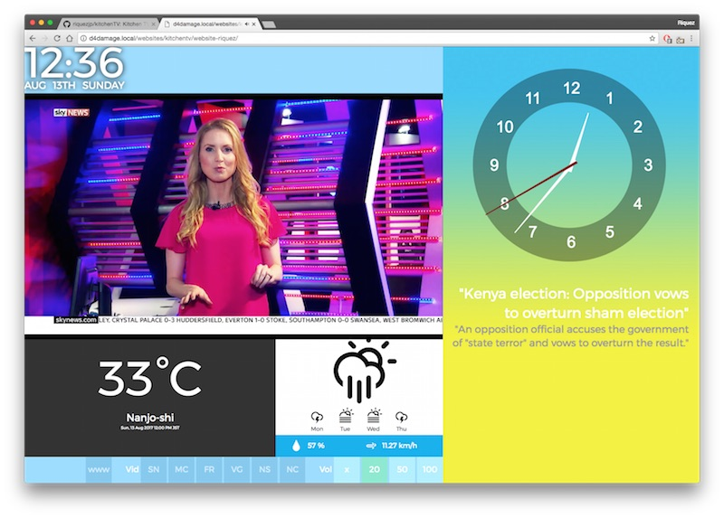

# kitchenTV
Kitchen TV; weather, clock, live news feeds &amp; video for Raspberry pi using PHP/javascript

This is a WEB based (PHP, Javascript) app I put together from various tools & scripts found on the web to create my own Kitchen TV : News, Clock & Weather music player & web browser display.

Here is a youtube video of it in action : https://www.youtube.com/watch?v=U5OF6tn-Ccg

If you want to set up the same thing: ======

1) Download my web files & upload to your own web space or host them locally.

2) EDIT the files to personalise it for your own needs:

* config.php has easy user settings you can change. A list of YouTube LIVE channels, you can edit the list for your own channels.
  - EDIT your city, country location for the weather api, how many days forecast

* images/cface4.png EDIT the clock image if you want your own design. You will find the background colours for sunset, sunrise etc in the images folder too.

* The page layout is designed to fit my TV. It will work on other screens but you would probably want to adjust slightly so it suits your screen. Here is how to best do that:

  - load the page in the browser & make it fullscreen.
  - The buttons on the bottom edge should be visible on screen. If they are off the bottom then reduce the height of the youtube video in config.php reduce the value for $yt_height.
  - if the news headlines text on the bottom right is too large, or small, you can edit the font size in main.css at the bottom of the file: #news span (the description) & #news a (the title) the values are in vw (viewport width units) but of course use px or em if you like.
  - if you need to adjust the size of the temperature: weather.css edit the font-size for .temperature
  - if you need to adjust the size of the forecast cloud graphics: weather.css edit ".forecast span img" right at the bottom (the smallicons) & .weathericon close to the top. change the wisdth % and you might need to adjust the negative margins too.
   - should you want to adjust the clock position main.css .clocks change the margin. margin: 50px auto; the first value is above & below, auto is left/right to keep it in the middle.

3) The www web browsing works in a frame, so it doesnt always work well with some websites - just be aware of this, you can always right-click open in new tab to get around that.

4) There is an IP changed alert - I use this to warn me my IP changed as I run my pi as a web server (for fun) I will disable this in the files, you can turn it on in config.php

==============

The resources I used to put this together:

- Building a weather App - Upamanyu Das
https://www.youtube.com/watch?v=lpLUx-0t7aE

- HTML5 analogue clock
https://www.script-tutorials.com/html5-clocks/

- YouTube Javascript API
https://developers.google.com/youtube/js_api_reference#GettingStarted

